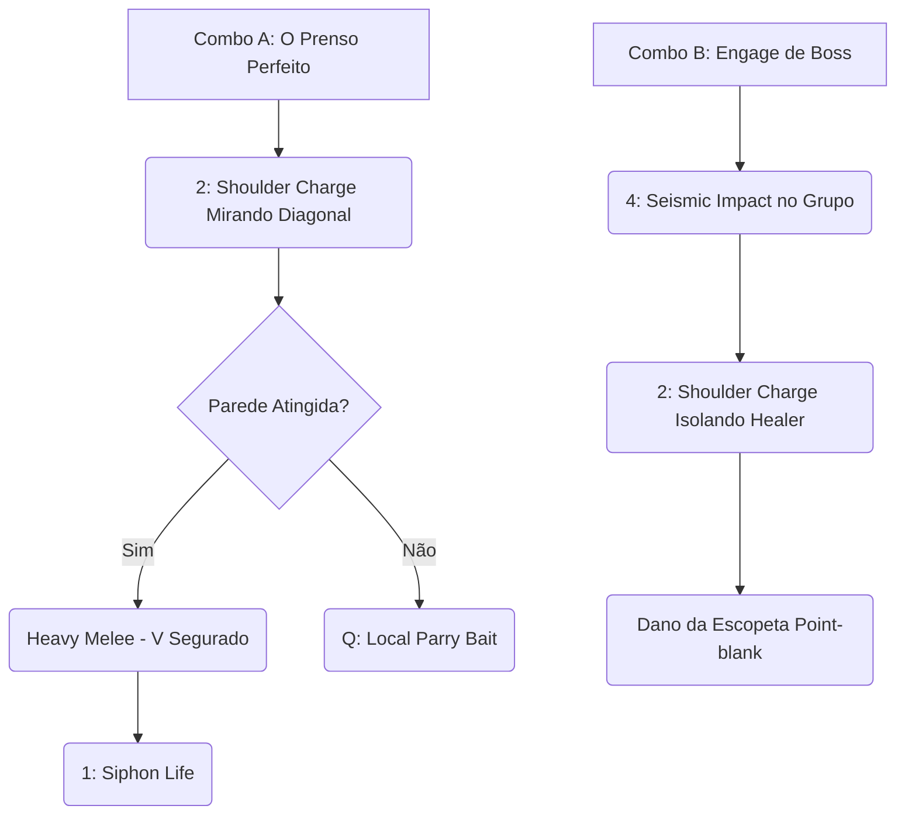

# 👑 GUIA DEFINITIVO COMPETITIVE-GRADE: ABRAMS

> [!NOTE]
> **Por:** Analista de E-sports de Elite & Especialista em Deadlock  
> **Público-Alvo:** Jogadores de Alto MMR / Pro Players

Bem-vindo ao material de estudo avançado para **Abrams**. Este guia remove as suposições e implementa a estrutura analítica padrão, traduzida para o Titã do jogo corpo-a-corpo. Abrams é o Ápice do **Vanguard/Frontline Enforcer**. Muito mais do que apenas "correr e socar", masterizar o Abrams exige domínio espacial de paredes (Wall-Stuns) e *Parry Baits*.

## 📑 Índice Rápido
*   [1. Introdução: Arquétipo, Power Spikes e Função no Meta](#1-introdução-arquétipo-power-spikes-e-função-no-meta)
*   [2. Kit Analítico: Decomposição de Habilidades](#2-kit-analítico-decomposição-de-habilidades)
*   [3. Combos Executáveis (Input-by-Input)](#3-combos-executáveis-input-by-input)
*   [4. Itemização (BUILD): Lógica de Sinergia](#4-itemização-build-lógica-de-sinergia)
*   [5. Macro & Posicionamento](#5-macro--posicionamento)
*   [6. Truques & Advanced Tech](#6-truques--advanced-tech)
*   [7. Jornada da Maestria: Do Nível 0 ao Pro Player](#7-jornada-da-maestria-do-nível-0-ao-pro-player)
*   [8. Biblioteca de Vídeos: Referências e Estudos de Caso](#8-biblioteca-de-vídeos-referências-e-estudos-de-caso)
*   [9. Radar do Meta: Análise do Patch Atual](#9-radar-do-meta-análise-do-patch-atual)
*   [10. Mentalidade 1v6: Os Melhores Itens para Carregar Solo](#10-mentalidade-1v6-os-melhores-itens-para-carregar-solo)

---

## 1. INTRODUÇÃO: Arquétipo, Power Spikes e Função no Meta

### 🧬 Arquétipo Fundamental
No mais alto nível competitivo, Abrams atua como um **Vanguard Bruiser**. Ele não causa dano primariamente por tiros de longa distância; todo o seu kit é desenhado para *forçar o inimigo a lutar na distância em que o Parry e o Heavy Melee* ditam as regras, absorvendo fogo inimigo com sua regeneração e bloqueando rotas de fuga.

### 📈 Análise de Power Spikes

| Fase do Jogo | Descrição do Impacto | Foco Principal |
| :--- | :--- | :--- |
| **Early Game** (0 - 3k) | Pico Altíssimo. A passiva de roubo de vida torna as trocas injustas cedo. | Bullying massivo na lane. Forçar os inimigos para baixo da torre. |
| **Mid Game** (10k - 20k) | Forte transição. A mobilidade do mapa permite *Ganks* com a Ultimate. | Controle de *Mid-Boss* com o livro/shotgun e isolamento de suportes. |
| **Late Game** (30k+) | Decai puramente em "Duolista 1v1", mas brilha como *Wall* colossal de 5k HP. | Sofrer todo *burst* das Ultimates inimigas, purgar CC duplo e proteger o atirador do seu time. |

> [!IMPORTANT]
> **Função no Meta Atual:** Você é o **Primary Engage**. É o Abrams quem pula da cobertura no meio de 4 pessoas com a Ultimate. Se o Abrams recua, a linha do seu time recua. A agressão dita o espaço no mapa.

---

## 2. KIT ANALÍTICO: Decomposição de Habilidades

### a) Siphon Life (1)
* **Mecânica:** Drena vida de inimigos em cone à frente. Quanto mais alvos, mais cura e dano passivo.
* **Uso Pro-Level:** Nunca inicie lutas com a drenagem. O raio expõe você. Use *somente* após jogar os alvos contra a parede ou quando sua vida cair abaixo de 40% em combates estendidos para estabilizar seu HP Passivo (*Infernal Resilience*).

### b) Shoulder Charge (2)
> [!WARNING]
> *A identidade mecânica do controle de grupo de Abrams.*

* **Mecânica:** Avança e arrasta inimigos. Se prensar um inimigo contra uma parede/obstáculo sólido, aplica um *Stun* massivo e garante o dano.
* **Frame Data:** Lança-o em velocidade extrema, mas exige *tracking* diagonal.

### c) Infernal Resilience (3) - Passiva Core
* **Mecânica:** Recupera passivamente uma % da vida perdida e converte atributos para resistência de tiro e mágica natural.
* **Uso Pro-Level:** É essa passiva que faz a "ilusão" de tanque. Ao comprar Itens de Vida Bruta (*Extra Health* / *Fortitude*), o coeficiente de regeneração fica opressor em x1 longo.

### d) Seismic Impact (4)
* **Mecânica:** Salto estratosférico que atordoa o raio de impacto massivo e paralisa o ar.
* **Análise Quantitativa:** Possui dano base alto, mas o tempo de conjuração aéreo permite fuga. O truque competitivo é usá-lo mirando ligeiramente *atrás* da parede de cobertura do inimigo, pegando-os pelo deslocamento do anel de choque.

---

## 3. COMBOS EXECUTÁVEIS (Input-by-Input)

#### Combo A: "O Prenso (Wall-Stun)"
1. `2` **(Shoulder Charge):** Ângulo de 45 graus visando a parede mais próxima do alvo. 
2. `V/Q` **(Melee Heavy):** Assim que ouvir o estalo do inimigo na parede (que está *stunnado*).
3. `1` **(Siphon Life):** Cancele a animação do seu soco ativando o cone de dreno point-blank.

---

## 4. ITEMIZAÇÃO (BUILD): Lógica de Sinergia

| Estágio | Itens Principais | Justificativa |
| :--- | :--- | :--- |
| 🔹 **Early Game** | `Melee Charge`, `Extra Health` | Soco pesado mais letal; aumenta drasticamente HP para a resiliência passiva. |
| 🔹 **Mid Game** | `Lifestrike`, `Diviner's Kevlar`, `Superior Stamina` | O *Kevlar* combado com o Salto (4) te dá invulnerabilidade mágica ao aterrissar. |
| 🔹 **Late Game** | `Colossus`, `Unstoppable`, `Siphon Bullets` | Você entra com *Hitbox* gigante, ativa Unstoppable e quebra o teclado na linha de trás. |

---

## 5. MACRO & POSICIONAMENTO

### A Arte do "Point Control"
> [!TIP]
> Em lutas de corredor (Ruas apertadas), Abrams é imbatível. Em espaços abertos (Mid do Boss), ele sofre kitting. Force seu inimigo a lutar em esquinas, portais de loja ou pontes estreitas.

---

## 6. TRUQUES & ADVANCED TECH

1. 🧱 **Manipulação da Física do Puxão:** Se você correr (Shift) e pular no momento que ativa o (2), você desliza ligeiramente *sobre* parapeitas curtas ignorando caixas como "paredes" e levando o inimigo para o abismo com você.
2. 🥊 **Melee Baiting (Meta do Abrams):** No Alto MMR, todos esperam que o Abrams dê soco forte. A "Tech" final é você caminhar em direção ao inimigo de cara, e apenas **pressionar F (Parry)** na cara dele. O inimigo, em pânico, vai tentar te explodir na facada e ser paralisado no seu parry.

---

## 7. JORNADA DA MAESTRIA: Do Nível 0 ao Pro Player

### 🐣 Estágio 1 (Foco: Parede)
*   **O Que Treinar:** Só usar o (2) se o eixo do ombro terminar em uma estrutura rígida. Parar de levar o inimigo pro nada.

### 🦅 Estágio 2 (Foco: Parry Mental)
*   **O Que Treinar:** Parar de abusar do "Heavy Melee Spam". Em lobbys Tier 2, as pessoas aprendem o timing do seu soco e você morre. Treine as fintas com arma de fogo e o (F) ofensivo.

### 🐉 Estágio 3 (Foco: O Guardião Perfeito)
*   **O Que Treinar:** Atuar não só matando, mas protegendo ativamente seu ADC (*Vindicta/Haze*). Seu corpo literalmente bloqueia a linha de visão; se colocar no fogo cruzado e segurar (1) anula investidas alheias brutalmente.

---

## 8. BIBLIOTECA DE VÍDEOS: Referências e Estudos de Caso
* 🎥 **[Abrams UNKILLABLE WALL Build - Deadlock]**
  * **Foco:** Assistir à disciplina de HP do jogador e como ele não queima Stamina atrás de inimigos ágeis, obrigando-os a vir até ele jogar seu jogo.

---

## 9. RADAR DO META: Análise do Patch Atual
*   **Ataque Melee:** O ataque corporal rápido do Abrams vem sofrendo nerfs constantes no escalonamento para desencorajar o spam cego que era popular nas baixas patentes de 2025.
*   **Status Atual:** Balanceado (Tier A). Seu combo com a parede ainda o mantém no esquadrão principal competitivo de iniciadores primários da Valve.

---

## 10. MENTALIDADE 1v6: Os Melhores Itens para Carregar Solo
Se precisa ser o lobo solitário, o Abrams de Suporte morre e nasce o "Deus do Melee":
*   **Frenzy (Tier 3) & Hunter's Aura:** Em *Solo Queue*, sua Shotgun fará 60% do trabalho, não apenas seus socos e encontrões de ombro. Acumular velocidade de disparo com aura que diminui a esquiva passiva inimiga derrete oponentes teimosos no *late game*. Não esqueça que sua Shotgun tem *spread* alto; aproxime-se sem dó.

---
*Fim do documento. Adapte-se ao meta, abuse das forças enquanto sobrevivem.*
