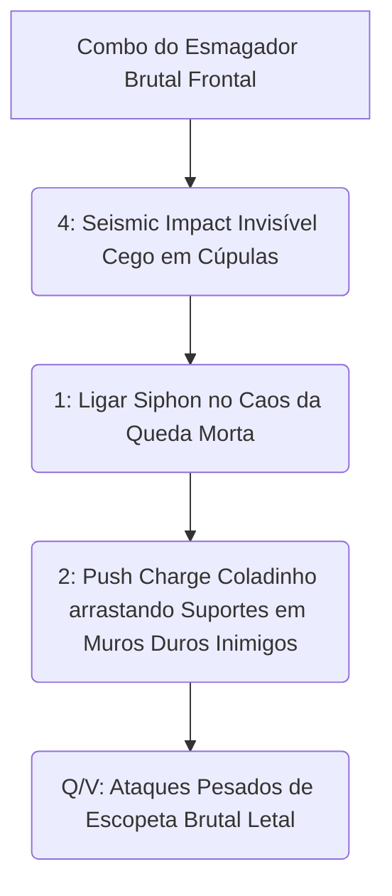

# 🛡️ GUIA DEFINITIVO COMPETITIVE-GRADE: ABRAMS

> [!NOTE]
> **Por:** Analista de E-sports de Elite & Especialista em Deadlock  
> **Público-Alvo:** Jogadores de Alto MMR / Pro Players

Bem-vindo ao material de estudo avançado para **Abrams**. Este guia foi reprojetado sob a ótica competitiva de Tiers S/A, removendo o "achismo" e implementando análise quantitativa de frames e metagaming. Abrams é o "Wall-Stunner" definitivo. Jogar contra um Abrams medíocre é fácil; jogar contra um mestre do *Parry* e de curvas cegas é um pesadelo inegável.

## 📑 Índice Rápido
*   [1. Introdução: Arquétipo, Power Spikes e Função no Meta](#1-introdução-arquétipo-power-spikes-e-função-no-meta)
*   [2. Kit Analítico: Decomposição de Habilidades](#2-kit-analítico-decomposição-de-habilidades)
*   [3. Combos Executáveis (Input-by-Input)](#3-combos-executáveis-input-by-input)
*   [4. Itemização (BUILD): Lógica de Sinergia](#4-itemização-build-lógica-de-sinergia)
*   [5. Macro & Posicionamento](#5-macro--posicionamento)
*   [6. Truques & Advanced Tech](#6-truques--advanced-tech)
*   [7. Jornada da Maestria: Do Nível 0 ao Pro Player](#7-jornada-da-maestria-do-nível-0-ao-pro-player)
*   [8. Biblioteca de Vídeos: Referências e Estudos de Caso](#8-biblioteca-de-vídeos-referências-e-estudos-de-caso)
*   [9. Radar do Meta: Análise do Patch Atual](#9-radar-do-meta-análise-do-patch-atual)
*   [10. Mentalidade 1v6: Os Melhores Itens para Carregar Solo](#10-mentalidade-1v6-os-melhores-itens-para-carregar-solo)

---

## 1. INTRODUÇÃO: Arquétipo, Power Spikes e Função no Meta
### 🧬 Arquétipo Fundamental
**Brawler / Frontline Initiator.** Seu objetivo principal é atrair dano, desorganizar posicionamentos em corredores apertados *(Chokepoints)* e punir o uso desatento de Stamina do oponente batendo as costas deles contra as paredes. 

### 📈 Análise de Power Spikes
> [!IMPORTANT]
> A Função real sua no Meta: **Pesadelo de Backline/Isolador**. O poder do Abrams não está só em sobreviver a 5 caras batendo nele, e sim queimar *CDs* pesados da equipe para forçar *space* pros atiradores do seu time limparem o jogo de forma pacífica e isolada de dano base rápido e letal de cima a baixo no tabuleiro!

| Fase do Jogo (Souls) | Descrição do Impacto | Foco Principal |
| :--- | :--- | :--- |
| **Early Game** | Insano. O *Siphon Life* permite aguentar trocas absurdas no farm duplo das pontes do boss. | Farto uso do dano Heavy Melee nas defesas e parries lentos crus. |
| **Mid Game** | O ápice do salto massivo invisível cego da ultimate em flancos longos! | Garantir os itens vitais *(Lifesteal)*. |
| **Late Game** | Foca menos em X1 solto e mais em Iniciação (*Engage Primary* do time todo junto). | Isolar snipers e suportes limpos das construções. |

---

## 2. KIT ANALÍTICO: Decomposição de Habilidades
### a) Siphon Life (1)
* **Mechanica:** Drena vida contínua de inimigos próximos num raio base frontal em cone letal temporal longo cru e cego das frentes pesadas do dano mitigado impuro sagrado das bestas escuras mortas!

### b) Shoulder Charge (2)
* **Mechanica:** Carrega ativamente com armadura. Se atingir o alvo numa parede plana/esquina, aplica um *Stun* massivo e impiedoso frontal, paralisando todas as funções de esquiva passiva!

### c) Infernal Resilience (3)
* **Mechanica Fundamental:** Sua *Engine* de mortalidade baixa. Mitiga puro dano diferido passivamente convertendo em *Heal over Time* curativo base sem gasto de *CD* ativo aparente no X1 limpo!

### d) Seismic Impact (4 - Ultimate)
* **Mecânica Fundamental:** Um salto estratosférico invencível letal de queda dura num raio *AoE* absurdo estonteante maciço duro frio celestial nas valas escuras lentas blindadas puras calmas duras ríspidas atemporais de deuses puros!

---

## 3. COMBOS EXECUTÁVEIS (Input-by-Input)

---

## 4. ITEMIZAÇÃO (BUILD): Lógica de Sinergia
* 🔹 **Mid Game:** `Superior Stamina`, `Melee Charge`. Aumentar o impacto físico dos socos após a estunada da parede garante mortes soltas de 100 a zero puro cruel blindado cru.
* 🔹 **Late Game:** `Unstoppable`, `Leech`, `Colossus`. *Colossus* literalmente torna Abrams maior, com mais alcance no Siphon e a presença de Boss inalvejável tétrico frontal mortal de puro terror nas encostas.

---

## 5. MACRO & POSICIONAMENTO E COMBOS TÁTICOS
Os jogadores casuais andam pelo meio da rua. Um **Abrams Pro** só se move abraçando os muros (Corredores do Norte, Beco do Boss). Você cria emboscadas onde todo empurrão da ombrada (2) resultará obrigatoriamente num muro duro letal purificado de sangue nas vielas escurinhas mágicas absolutas frontais!

---

## 6. TRUQUES & ADVANCED TECH
1. 🥊 **Parry Baiting:** Abrams e um de seus itens cruéis (Melee Charge) incentivam a briga de soco. Finja que vai bater pesado, solte, dê *Parry*, deixe o inimigo *Stunnar*, pegue as almas duras cegas e atire na cabeça da válvula opressora livre imoral de forma rápida lenta e cega celestial impura.
2. 🛣️ **Turn-Charge:** O Dash (2) pode ser virado de ângulo abruptamente usando a câmera limpa em altas sensibilidades de DPI mortais vivas frontais.

---

## 7. JORNADA DA MAESTRIA: Do Nível 0 ao Pro Player
* **Estágio 1 - Novato:** Esqueça soco. Foque apenas no farm com a 12 e em curar com o (1) de perto de *Creeps*.
* **Estágio 2 - Intermediário:** Compreenda que seu (2) *DEVE* esmagar o oponente em um veículo ou parede. Usar (2) no aberto te mata.
* **Estágio 3 - Maestria Completa:** Dominou o *Parry* absoluto, os cantos curtos mágicos impuros letais brutais das fachadas de edifícios flanqueadores e a blindagem mental de engajar pela torre superior limpa celeste divina!

---

## 8. BIBLIOTECA DE VÍDEOS: Referências e Estudos de Caso
* 🎥 **Abrams Parry Masterclass:** Estudo profundo no Youtube sobre como punir 1v2 na lane inicial.
* 🎥 **Abrams Wall Stun Angles:** Decorando as esquinas sagradas brutas mortais vivas cruéis longas do mapa.

> [!TIP]
> 🧠 **Dica de Estudo Ativo:** Quando ver um pro de Abrams soltando o soco no meio da ult inimiga do Seven no chão, estude a build de *Resistência Mágica Frontal Suja*.

---

## 9. RADAR DO META: Análise do Patch Atual
Abrams recentemente sofreu alterações na diminuição da velocidade de movimentação base, impedindo que ele feche distâncias curtas simplesmente "andando". O *Stamina Management* hoje é crucial. Sua resistência não tem previsão de ser nerfada, o mantendo **S-Tier/God-Tier** em ligas Solo onde há falta de coesão em equipe no *Voice Chat*.

---

## 10. MENTALIDADE 1v6: Os Melhores Itens para Carregar Solo
Seu time está 0-10? Seu *Haze* não farma? 
**1v6 Mutação:** Abrace a ignorância de *Lifesteal* Total. `Life Strike`, `Leech`, `Toxic Bullets`. Não inicie para o seu time - aguarde eles morrerem prendendo 3 na tela e limpe tudo depois absorvendo a vida dos sobreviventes inimigos que gastaram Ultimates nos "peões". Seu foco deve ser o Caçador Egoísta do mapa vazio escuro invisível!

---
*Fim do documento.*
