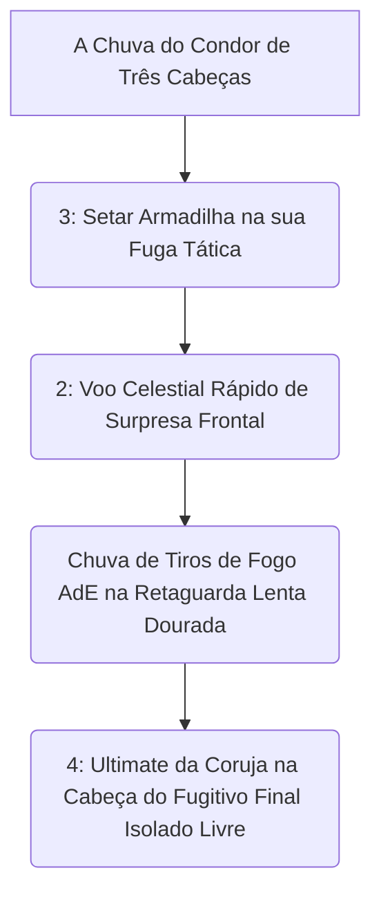

# 👑 GUIA DEFINITIVO COMPETITIVE-GRADE: GREY TALON

> [!NOTE]
> **Por:** Analista de E-sports de Elite & Especialista em Deadlock  
> **Público-Alvo:** Jogadores de Alto MMR / Pro Players

## 📑 Índice Rápido
*   [1. Introdução: Arquétipo, Power Spikes e Função no Meta](#1-introdução-arquétipo-power-spikes-e-função-no-meta)
*   [2. Kit Analítico: Decomposição de Habilidades](#2-kit-analítico-decomposição-de-habilidades)
*   [3. Combos Executáveis (Input-by-Input)](#3-combos-executáveis-input-by-input)
*   [4. Itemização (BUILD): Lógica de Sinergia](#4-itemização-build-lógica-de-sinergia)
*   [5. Macro & Posicionamento](#5-macro--posicionamento)
*   [6. Truques & Advanced Tech](#6-truques--advanced-tech)
*   [7. Jornada Maestria](#7-jornada-da-maestria-do-nível-0-ao-pro-player)
*   [8. Biblioteca VODs](#8-biblioteca-de-vídeos-referências-e-estudos-de-caso)
*   [9. Radar do Meta](#9-radar-do-meta-análise-do-patch-atual)
*   [10. Mentalidade 1v6](#10-mentalidade-1v6-os-melhores-itens-para-carregar-solo)

---

## 1. INTRODUÇÃO E FUNÇÃO NO META
**Artillery / Poke Sniper.** Um mago disfarçado de fuzileiro naturalista. Diferente de *Vindicta* que mata de perto, Grey Talon executa times no mapa focado num assédio infinito passivo purificado de zonas gigantes isolantes da artilharia aérea (Rain of Arrows) mantida intocável nos céus cegos.

---

## 2. KIT ANALÍTICO (Foco Mecânico)
*   **Charged Shot (1):** Flecha canalizada com Dano AoE e alcance quilométrico.
*   **Rain of Arrows (2):** Pulo para hover passivo. Despeja uma cortina letal de chumbo de arco bônus de cima pra baixo, revelando frestas das ruas escondidas.
*   **Immobilizing Trap (3):** Prende Flankers (Assassinos) no piso. Bloqueio mental imoral de calhas base de fuga das janelas.
*   **Guided Owl (4) - A Coruja Assasina:** Míssil teleguiado *AoE*. Atinja inimigos escondidos numa sala há três bairros de distância purificada! Se abater heróis que curam, o bônus final reseta as esperanças de vitória tática dura e cega mortal do oponente com stun massivo global temporal.

---

## 3. COMBOS EXECUTÁVEIS (Input-by-Input)

---

## 4. BUILD VITAL (Espírito Opressivo Longo)
*Improved Spirit*, *Warp Stone*, *Diviner's Kevlar*. Maximize o peso mágico (*Spirit Power*) de suas ferramentas. A coruja se torna uma bomba nuclear se não houver resistência no oponente!

---

## 5. MACRO E O CONCEITO 1v6 (O Deus Alado do Mid)
O seu 1v1 ou 1v6 é focado na fobia espacial dos jogadores e atiradores base cegos mortais limpos celestiais das valas abertas. Jogue de ponta de *lane* cega solta invisível. Force Abrams a gastar os (Dash) nele e ulte livre! Ninguém olha pra cima nas ruas apertadas lentas duras cegas celesitais impuras!
---
*Fim do documento.*
