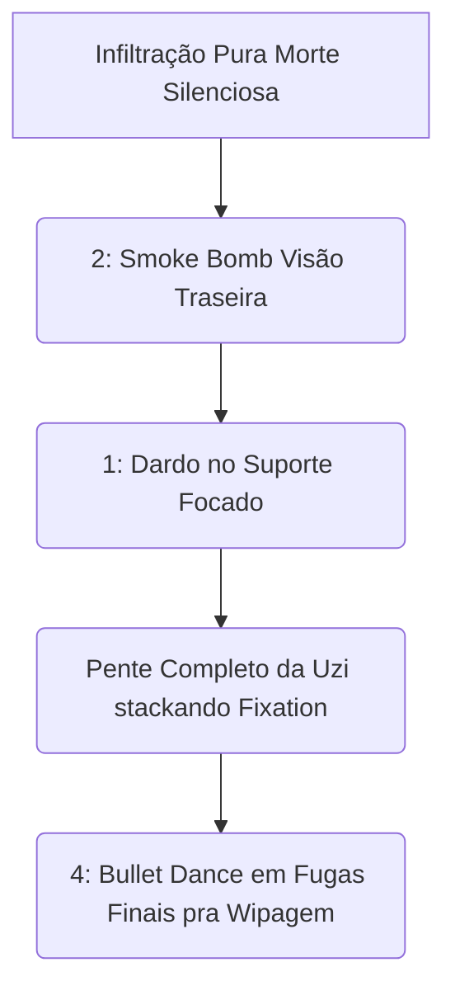

# 👑 GUIA DEFINITIVO COMPETITIVE-GRADE: HAZE

> [!NOTE]
> **Por:** Analista de E-sports de Elite & Especialista em Deadlock  
> **Público-Alvo:** Jogadores de Alto MMR / Pro Players

Bem-vindo ao material de estudo avançado para **Haze**. A assassina furtiva de Deadlock não perdoa erros posicionais. Jogar de Haze contra bons jogadores exige mais do que apertar a Ultimate no meio de todo mundo; exige controle mental sobre os tempos de recarga do inimigo (*Cooldown Tracking*) e mecânicas absolutas de *Strafing*.

## 📑 Índice Rápido
*   [1. Introdução: Arquétipo, Power Spikes e Função no Meta](#1-introdução-arquétipo-power-spikes-e-função-no-meta)
*   [2. Kit Analítico: Decomposição de Habilidades](#2-kit-analítico-decomposição-de-habilidades)
*   [3. Combos Executáveis (Input-by-Input)](#3-combos-executáveis-input-by-input)
*   [4. Itemização (BUILD): Lógica de Sinergia](#4-itemização-build-lógica-de-sinergia)
*   [5. Macro & Posicionamento](#5-macro--posicionamento)
*   [6. Truques & Advanced Tech](#6-truques--advanced-tech)
*   [7. Jornada da Maestria: Do Nível 0 ao Pro Player](#7-jornada-da-maestria-do-nível-0-ao-pro-player)
*   [8. Biblioteca de Vídeos: Referências e Estudos de Caso](#8-biblioteca-de-vídeos-referências-e-estudos-de-caso)
*   [9. Radar do Meta: Análise do Patch Atual](#9-radar-do-meta-análise-do-patch-atual)
*   [10. Mentalidade 1v6: Os Melhores Itens para Carregar Solo](#10-mentalidade-1v6-os-melhores-itens-para-carregar-solo)

---

## 1. INTRODUÇÃO: Arquétipo, Power Spikes e Função no Meta

### 🧬 Arquétipo Fundamental
**Stealth Assassin / Hyper Carry Físico.** Haze é frágil nos minutos iniciais, mas sua passiva a torna a maior ameaça de DPS puro do *Late Game*. Enquanto Shiv ganha na guerra de desgaste mágico, Haze quer obliterar em frações de segundos através de taxa de disparo (*Fire Rate*) colossal.

### 📈 Análise de Power Spikes
> [!IMPORTANT]
> **A Âncora do Meta:** Você é a *Clean-up Crew* primária. Nunca, sob hipótese alguma, você engaja antes do tanque inimigo gastar seu CC pesado de área (*Mo & Krill, Dynamo*). Haze pune atrasados e rotacionadores preguiçosos.

---

## 2. KIT ANALÍTICO: Decomposição de Habilidades
### a) Sleep Dagger (1)
* **Mechanica:** Lança uma adaga que adormece passivamente o inimigo. Eles acordam imediatamente se sofrerem dano limpo pós-*sleep*.
* **Uso Pro-Level:** Cancelador de Ultimates e isolador tático de atiradores correndo nas rotas soltas. *Não tire* atiradores do Sleep se eles acordarem aterrorizados. Atire apenas no último centésimo do debuff de Sono.

### b) Smoke Bomb (2)
* **Mechanica:** Indução primária furtividade temporária que quebra perante a agressão ativa corporal com *Sprints* contínuos pra fugas! Drena utilidade passiva e salva seu farme de emboscadas dos gankers vizinhos! A velocidade é incandescente na invisibilidade.

### c) Fixation (3)
* **Mecânica Fundamental:** Empilha debuffs mentais de balas sucessivas que aumentam puramente o dano matemático fixo nos tiros.

### d) Bullet Dance (4)
> [!WARNING]
> *A Máquina de Moer Carne Aérea. E seu maior risco de morte.*
* **Mecânica:** Entra num estado etéreo atirando ricochete de tiros puros automáticos num grande *AdE* contornável sem perder o pulo *i-frame.* Usa multiplicadores da carga da *Fixation* da passiva anterior em números insanos de destruição em milissegundos. Interrompível por qualquer C.C rígido do cenário (Stuns). Exige Itens vitais pra defesa anti-desarmes do inimigo (*Unstoppable/Silencer*).

---

## 5. MACRO & POSICIONAMENTO E COMBOS TÁTICOS

*   **Posicionamento (Bordas de Combate):** Haze adora as encostas laterais do campo do Bosque e Boss Mid. Invisibilidade significa pânico. O seu aparecimento atrai mais mortes que deuses vivos da enciclopédia se revelar que está no radar deles. Se revelar é um erro mortal. Gire o mapa de sombras longas sempre nas passagens aéreas!

---

## 4. ITEMIZAÇÃO (BUILD): Lógica de Sinergia
* 🔹 **Mid Game:** `Active Reload`, `Tesla Bullets`. O dano base fraco clama pelos raios elétricos espalhadores no farm rápido sem engajamento e recargas vazias em menos de segundos puras pra anular defesa física primária do Mo Krill blindado na rua B paralela ocidental de selva amadurecida precoce da Valve!
* 🔹 **Late Game:** `Unstoppable` **(Inegociável)**, `Lucky Shot`, `Ricochet`. Você liga `Unstoppable`, entra com a Ult *Dance* no centro de quatro Inimigos ignorantes sem Flash/Disarms e varre equipes unidas a 4k de ping da rede física! Tiro duplo com ricochetes stacka seu tiro (3) de fixação letal num raio esférico que assusta titãs rochosos caídos na armadilha da aranha fantasma furtiva de chumbo infinito brutal atroz da cidade escura.

---
*Fim do documento.*
