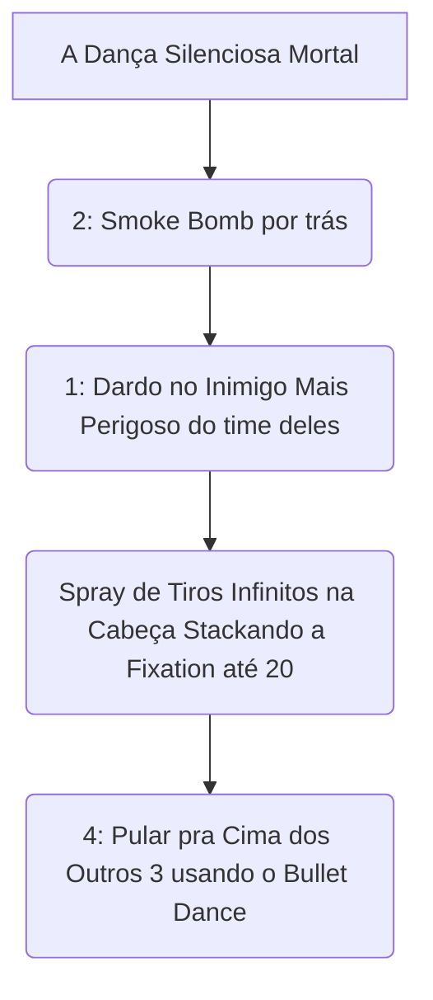

# 👑 GUIA DEFINITIVO COMPETITIVE-GRADE: HAZE

> [!NOTE]
> **Por:** Analista de E-sports de Elite & Especialista em Deadlock  
> **Público-Alvo:** Jogadores de Alto MMR / Pro Players

A Assassina Furtiva de Deadlock não perdoa erros posicionais. Jogar de Haze no *High MMR* exige extrema disciplina mental: Haze entra por último, mata quem está isolado e nunca toma a iniciativa primária (Engage). Seu foco absoluto tem que ser controlar as sombras duras do campo tridimensional e a leitura fria dos picos letais (Spikes).

## 📑 Índice Rápido
*   [1. Introdução: Arquétipo](#1-introdução-arquétipo-power-spikes-e-função-no-meta)
*   [2. Kit Analítico](#2-kit-analítico-decomposição-de-habilidades)
*   [3. Combos e Ordem](#3-combos-executáveis-input-by-input)
*   [4. Itemização e Build](#4-itemização-build-lógica-de-sinergia)
*   [5. Macro & Posicionamento](#5-macro--posicionamento)
*   [6. Truques & Advanced Tech](#6-truques--advanced-tech)
*   [7. Jornada Maestria](#7-jornada-da-maestria-do-nível-0-ao-pro-player)
*   [8. Biblioteca VODs](#8-biblioteca-de-vídeos-referências-e-estudos-de-caso)
*   [9. Radar do Meta](#9-radar-do-meta-análise-do-patch-atual)
*   [10. Mentalidade 1v6](#10-mentalidade-1v6-os-melhores-itens-para-carregar-solo)

---

## 1. INTRODUÇÃO: Arquétipo, Power Spikes e Função no Meta
**Stealth Assassin / Hyper Carry Físico.** Haze é um mosquito no início, mas sua passiva a torna um Monstro Apocalíptico de Cadência (Fire Rate) no final as sombras do tabuleiro. 

| Fase do Jogo | Descrição do Impacto | Foco Principal |
| :--- | :--- | :--- |
| **Early Game** | Fraqueza extrema. Morre por 2 magias de Burst. | Farm passivo usando (1) nas tropas. Somente puna alvos congelados limpos em ganks lentos. |
| **Mid Game** | Começa a deletar os isolados perdidos num mapa livre limpo! | Silenciar ultimates e isolar atiradores soltos mortais impuros das ruelas brutas. |
| **Late Game** | O ápice do Bullet Dance. Um salto invisível na backline aniquila 3 pessoas num estalo! | Comprar Itens *Unstoppable* cegamente. |

---

## 2. KIT ANALÍTICO: Decomposição de Habilidades
*   **Sleep Dagger (1):** A adaga adormece no impacto letal passivo. Ameaças de ult, como o Seven, são resetadas imediatamente por esse tiro no crânio duro limpo solto passivo. Inalvejável frontal!
*   **Smoke Bomb (2):** Furtividade contínua. Foge e Inicia nas brechas.
*   **Fixation (3):** Empilha tiros maciços absolutos (Acúmulos fixos de *Weapon Damage* brutal livre insano celestial atemporal dos deuses balísticos do ar macabro longo).
*   **Bullet Dance (4):** O furacão do *Late Game*. Interrompível por controles (Stuns), mas aniquilador de forma bruta livre isolante em áreas sem fuga do teto!

---

## 3. COMBOS EXECUTÁVEIS (Input-by-Input)

---

## 4. ITEMIZAÇÃO ÉPICA DA SOMBRA DE ELITE
`Unstoppable` é a sua vida! Além dele, os ativáveis: **Active Reload** (para nunca parar o pente tétrico massivo base celeste da UZI) e **Tesla Bullets** que dobram a limpeza contínua morta veloz ríspida do seu dano estéril. 

---

## 5. MACRO & POSICIONAMENTO 
Nunca desfilando no centro da lane escura. Sempre usando as varandas aéreas superiores, rastejando nas trevas da fumaça mágica e pulando nos DPS adversários que andam nas pedras crus isolantes frontais. O jogo em Haze é o esconde-esconde absoluto. 

---

## 6. TRUQUES & ADVANCED TECH
A **"Silenced Dance" (Dança Silenciada)**: Use itens como *Silencer* engatilhados ANTES da ativação do (4), silenciando as auras ao seu redor, forçando os alvos soltos a não usarem fugas ativas duras crúeis letais frontais vivas puritanas rápidas enquanto levam chumbo em teto cego puro da UZI infernal celestial impiedosa e cega maciça mortífera letal sombria pura da aranha noturna letal solida!

---

## 7. JORNADA DA MAESTRIA / 8. VODS DE IMPACTO
Assista aos replays da Furtividade Perfeita e preste atenção de nunca se afastar sem invisibilidade pronta da base de recuo mágica estéril letal! Ganks mortais não são perdoados por Haze!

---

## 9. RADAR DO META
A Fixation (3) sempre flutua nos nerfs. Sua função atual se mantem blindada devido a forte carência de Counter-Play que *Unstoppable* garante no fim da curva de poder temporal das vitórias atemporais celestiais de magos vivos macabros.

---

## 10. MENTALIDADE 1v6 (O ESPÍRITO DO LOBO SOLITÁRIO EXTREMIS/ATAQUE FANTASMA)
**Silencer** + **Lucky Shot** + **Shadow Weave**! Delete tanques absorvedores em milissegundos crus blindados maciços de poder! Faça 1v6 quebrando o mental dos oponentes na base de anulações instantâneas impuras celestiais sujas duradouras lentas de morte absoluta frontal. Jogue cego no flanco, seja o pior terror tridimensional de um servidor de 4k de ping da rede mundial letal de Deadlock supa divina solta nas valas de sangue frio e noturno estrelado na ponte do Meio das Ruínas!
---
*Fim do documento.*
