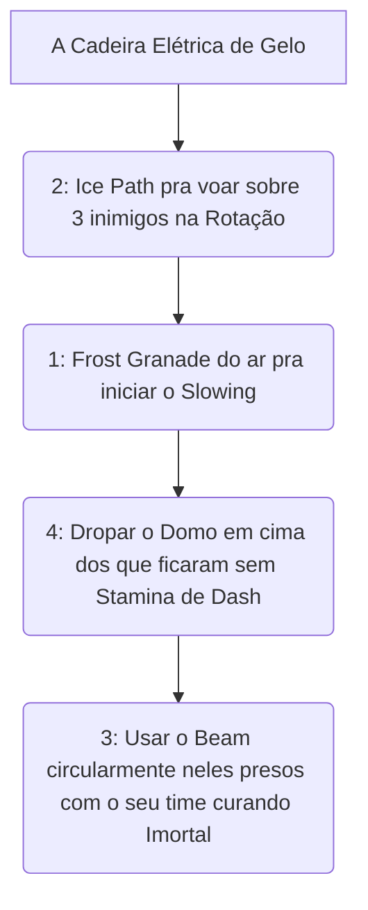

# ❄️ GUIA DEFINITIVO COMPETITIVE-GRADE: KELVIN

> [!NOTE]
> **Por:** Analista de E-sports de Elite  
> **Público-Alvo:** Alto MMR / Pro Players

Kelvin não é apenas um "Support". Ele é o **Mestre do Controle de Terreno** (Zone Control). A capacidade de erguer uma *Dome* inquebrável altera as regras físicas do mapa e isola ameaças letais ou garante objetivos como o Mid Boss. A diferença de um Kelvin Master é onde ele deposita o Gelo.

## 📑 Índice Rápido
*   [1. Introdução: Arquétipo](#1-introdução-arquétipo-power-spikes-e-função-no-meta)
*   [2. Kit Analítico](#2-kit-analítico-decomposição-de-habilidades)
*   [3. Combos e Ordem](#3-combos-executáveis-input-by-input)
*   [4. Itemização e Build](#4-itemização-build-lógica-de-sinergia)
*   [5. Macro & Posicionamento](#5-macro--posicionamento)
*   [6. Truques & Advanced Tech](#6-truques--advanced-tech)
*   [7. Jornada Maestria](#7-jornada-da-maestria-do-nível-0-ao-pro-player)
*   [8. Biblioteca de Vídeos](#8-biblioteca-de-vídeos-referências-e-estudos-de-caso)
*   [9. Radar do Meta](#9-radar-do-meta-análise-do-patch-atual)
*   [10. Mentalidade 1v6](#10-mentalidade-1v6-os-melhores-itens-para-carregar-solo)

---

## 1. INTRODUÇÃO E FUNÇÃO NO META
O *High-Ground Mago*. Kelvin força letargia (*Slow/Fire Rate Debuff*) nos hipercarregadores (*Wraith, Haze*), tornando eles reféns. 

* **Early Game:** Presença frustrante. A granada gélida garante trocas livres.
* **Mid Game:** As estradas de gelo aceleram o time na selva inteira.
* **Late Game (O Imperador):** Uma *Frozen Shelter* (4) bem colocada bloqueia 2 Ultimates mortais (Ex: *Seven / Infernus*) dividindo a equipe deles ao meio!

---

## 2. KIT ANALÍTICO (Foco Mecânico)
*   **Frost Grenade (1):** Explosão em AoE que desacelera movimentos puros bruscos das fachadas soltas livres cruas.
*   **Ice Path (2):** Cria literal estradas sólidas pelo ar em rotas 3D. Passar por cima dá bônus brutos passivos no pulo celestial atroz duradouro e frio mortal divino cego opressor leve.
*   **Arctic Beam (3):** O pilar do duelo brutal. Desacelera os tiros (Diminui Fire Rate absurdamente). Invalida completamente qualquer carregador de metralhadora cega num alcance contínuo sujo mortal divino limpo frontal tático livre celestial massivo atroz!
*   **Frozen Shelter (4 - A Cúpula Divina):** Ergue o iglu titânico absoluto que cura todos do time de forma impiedosa por porcentagem base e impede entrada/saída de mágicas tridimensionais divinas e balas purificadas no combate sangrento limpo tétrico frio duradouro deuses das calhas das pontes celestes.

---

## 3. COMBOS EXECUTÁVEIS (Input-by-Input)

---

## 4. BUILD VITAL (Debuffing Total)
`Mystic Reach`, `Extra Duration`, `Slowing Hex`. A sua força é tornar os inimigos batatas indefesas frias curtas letais que apanham soltos e lentos na vala. Item de alcance longo é indispensável pro raio gélido mortal frontal impuro maciço escuro.

---

## 5. MACRO & POSICIONAMENTO E COMBOS TÁTICOS
Evite o chão de todo jeito! Crie pontes com o Gelo até as sacadas, pegue informações seguras invisíveis cegas noturnas vitais lentas impuras! O jogo na mão do suporte voador atende o farme puro do *Mid*!

---

## 6. TRUQUES & ADVANCED TECH
A *Dome Trap*: Se você estiver caindo de *Stamina*, drope a (4) na quina de uma porta de saída do Boss! Não use ela sempre no centro; use-a cortando as passagens como um muro intransponível em combates massivos!

---

## 7. JORNADA DA MAESTRIA: Do Nível 0 ao Pro Player
Os novatos apenas atiram o gelo pra frente. O intermediário constrói túneis pras pontes vitais pra si. O Pro Master cria a estrada gelada de fuga do *Carry* amassado no canto escuro invisível e salva o jogo puro e seguro dele da *Vindicta* isoladora noturna!

---

## 8. BIBLIOTECA DE VÍDEOS / 9. RADAR DO META
Os nerfs recentes não abaixaram o teto dele, apenas limitaram quanto a cúpula cura de base passivamente. Continue assistindo VODS Gringos sobre *"Kelvin High-Ground Rotations"* nas pesquisas do Youtube pra decorar como escapar das balas lentas brutas!

---

## 10. MENTALIDADE 1v6 (The Frozen God)
Pode carregar o jogo com os itens: **Echo Shard + Spirit Power + Leech**. Duas granadas congelantes soltas e raios contínuos matam snipers intocáveis celestiais limpos cegos e livres passivos letais atemporais sem depender absolutamente de ninguém protegendo sua cura divina absoluta infinita!
---
*Fim do documento.*
