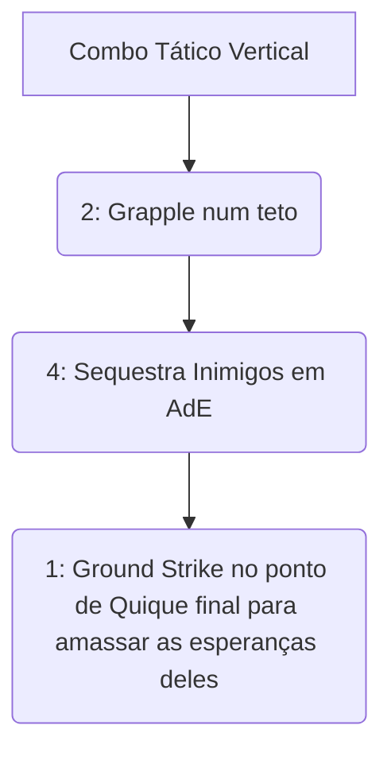

# 👑 GUIA DEFINITIVO COMPETITIVE-GRADE: LASH

> [!NOTE]
> **Por:** Analista de E-sports de Elite & Especialista em Deadlock  
> **Público-Alvo:** Jogadores de Alto MMR / Pro Players

Bem-vindo ao material de estudo de **Lash**. Arrogante, violento e extremamente móvel. Lash é o protótipo perfeito do **Dive Assassin/Vertical Bruiser**. Se não souber gerenciar seu vigor aéreo e usar o chicote para aterrissar massacres brutais em atiradores vulneráveis na linha tênue das varandas, você será um peso morto. O Domínio Aéreo Absoluto é a chave.

## 📑 Índice Rápido
*   [1. Introdução: Arquétipo, Power Spikes e Função no Meta](#1-introdução-arquétipo-power-spikes-e-função-no-meta)
*   [2. Kit Analítico: Decomposição de Habilidades](#2-kit-analítico-decomposição-de-habilidades)
*   [3. Combos Executáveis (Input-by-Input)](#3-combos-executáveis-input-by-input)
*   [4. Itemização (BUILD): Lógica de Sinergia](#4-itemização-build-lógica-de-sinergia)
*   [5. Macro & Posicionamento](#5-macro--posicionamento)
*   [6. Truques & Advanced Tech](#6-truques--advanced-tech)
*   [7. Jornada da Maestria: Do Nível 0 ao Pro Player](#7-jornada-da-maestria-do-nível-0-ao-pro-player)
*   [8. Biblioteca de Vídeos: Referências e Estudos de Caso](#8-biblioteca-de-vídeos-referências-e-estudos-de-caso)
*   [9. Radar do Meta: Análise do Patch Atual](#9-radar-do-meta-análise-do-patch-atual)
*   [10. Mentalidade 1v6: Os Melhores Itens para Carregar Solo](#10-mentalidade-1v6-os-melhores-itens-para-carregar-solo)

---

## 1. INTRODUÇÃO: Arquétipo, Power Spikes e Função no Meta
### 🧬 Arquétipo Fundamental
O **Diver Bruiser.** Escala primariamente com as surpresas verticais e suga a vida de atiradores (*Snipers* como Vindicta) impedindo que fiquem nos tetos. 

> [!CAUTION]
> **Função Master:** Limpador dos Céus. Você deve encontrar onde a retaguarda inimiga está se escondendo, voar por trás e sequestrar na *Ult* isoladora.

---

## 2. KIT ANALÍTICO: Decomposição de Habilidades

### a) Ground Strike (1)
* **Mecânica:** Pisa forte vindo do ar; dano aumenta conforme sua altitude inicial na queda massiva destrutiva passiva rápida que freia inimigos de fugas em portas estreitas.

### b) Grapple (2)
> [!WARNING]
> *O chicote tático de elevação física.*
* **Mecânica Fundamental:** Puxa-se para a superfície e ganha picos de reinício temporal na inércia, pulos rápidos e desvios puros para os abates secos focados com chicotadas mortificais de base em fuga passiva veloz nas arenas do centro do mapa verde intenso do chefão Mid.

### c) Flog (3)
* **Mecânica:** Acerta inimigos enchendo vida se for agressivo de perto no chiocte brutal duro em contato com múltiplos inimigos curando em AdE forte purificadas curas de *Soul* curtas temporárias.

### d) Death Drop (4 - Ultimate)
* **Mecânica Fundamental:** Sobe até os céus capturando alvos marcados os atirando em quedas livres para estrondos estonteantes no chão ao lado do tanque da sua equipe para execução instantânea do infeliz sequestrado aéreo.

---

## 3. COMBOS EXECUTÁVEIS (Input-by-Input)

1. `2` **Grapple:** Voar na direção do suporte intocável de base.
2. `4` **Death Drop:** Arremessá-lo de cara nos Abrams aliados agressivos do seu grupo.
3. `1` **Ground Strike:** Cair junto batendo 600 de Dano direto no crânio alvo lento de atordoamento letal dos céus nas ruelas cruéis das *Backlines* de base do jogo!

---

## 4. ITEMIZAÇÃO (BUILD): Lógica de Sinergia
* 🔹 **Mid Game:** `Superior Stamina`, `Improved Burst`. O Stun do ar requer estamina máxima pra fugir se der bobeira.
* 🔹 **Late Game:** `Warp Stone`, `Leech`, `Unstoppable`. Voe em linhas oblíquas, prenda todo mundo no *drop* físico e absorva as passivas. Flog rouba a base toda do suporte morto! 

---

## 9. RADAR DO META: Análise do Patch Atual
Lash recebeu cortes pesados no escalonamento inicial do feixe do Puxão. Em compensação as quebras físicas em tetos o mantém como Assasino Opressivo *S-Tier* letal e único na dinâmica 3D que o Deadlock aplica fisicamente como diferencial bruto perante mobas padrão!

---
*Fim do documento.*
