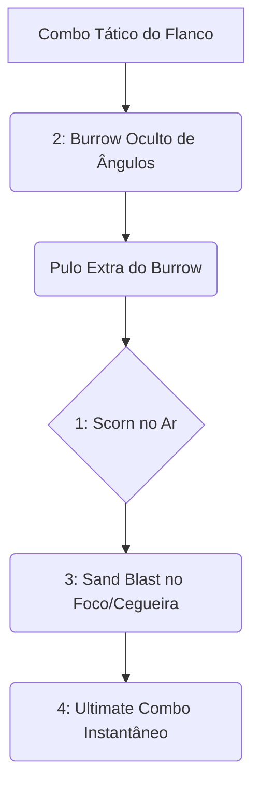

# 👑 GUIA DEFINITIVO COMPETITIVE-GRADE: MO & KRILL

> [!NOTE]
> **Por:** Analista de E-sports de Elite & Especialista em Deadlock  
> **Público-Alvo:** Jogadores de Alto MMR / Pro Players

Bem-vindo ao material de estudo avançado para **Mo & Krill**. Este guia implementa a estrutura analítica padrão. A dupla dinâmica é o bastião do **Disruption Tank / Lockdown**. Conhecidos pelo famigerado "Burrow" na terra, mestres do Mo & Krill não são apenas chatos, são ditadores de mapa que anulam as principais ameaças so inimigo e aplicam Desarmes massivos.

## 📑 Índice Rápido
*   [1. Introdução: Arquétipo, Power Spikes e Função no Meta](#1-introdução-arquétipo-power-spikes-e-função-no-meta)
*   [2. Kit Analítico: Decomposição de Habilidades](#2-kit-analítico-decomposição-de-habilidades)
*   [3. Combos Executáveis (Input-by-Input)](#3-combos-executáveis-input-by-input)
*   [4. Itemização (BUILD): Lógica de Sinergia](#4-itemização-build-lógica-de-sinergia)
*   [5. Macro & Posicionamento](#5-macro--posicionamento)
*   [6. Truques & Advanced Tech](#6-truques--advanced-tech)
*   [7. Jornada da Maestria: Do Nível 0 ao Pro Player](#7-jornada-da-maestria-do-nível-0-ao-pro-player)
*   [8. Biblioteca de Vídeos: Referências e Estudos de Caso](#8-biblioteca-de-vídeos-referências-e-estudos-de-caso)
*   [9. Radar do Meta: Análise do Patch Atual](#9-radar-do-meta-análise-do-patch-atual)
*   [10. Mentalidade 1v6: Os Melhores Itens para Carregar Solo](#10-mentalidade-1v6-os-melhores-itens-para-carregar-solo)

---

## 1. INTRODUÇÃO: Arquétipo, Power Spikes e Função no Meta

### 🧬 Arquétipo Fundamental
**Lockdown Tank/Bruiser**. Enquanto Abrams joga o adversário contra a parede, Mo & Krill literalmente o enterra. A força vital deste herói, além do alto HP, reside em sua Ultimate ser o CC direto (*Single-target*) mais duradouro e perigoso do meta, servindo como contador natural a Assassinos como Shiv, Haze e Vindicta.

### 📈 Análise de Power Spikes

| Fase do Jogo | Descrição do Impacto | Foco Principal |
| :--- | :--- | :--- |
| **Early Game** (0 - 3k) | Pico Altíssimo. A passiva do Scorn garante cura massiva nas tropas e inimigo. | Assédio e troca irrestrita pelo "lifesteal" nativo das skills Dano Base em área. |
| **Mid Game** (10k - 20k) | Terror Invisível. Ter o *Burrow* num mapa solto faz do herói um pesadelo nos túneis. | Flancos e ganks inter-rotas, desarmar alvos primários (*Disarm*). |
| **Late Game** (30k+) | O CC Final. A ultimate segura o alvo tempo suficiente pro time estourá-lo. | Eliminar a *Win-Condition* inimiga com *Combo* e suportar dano passivo. |

> [!IMPORTANT]
> **Função no Meta Atual:** Você é a âncora de contenção. Inicar *front to back* (frente a frente) contra DPS focados resultará na sua morte. Mo & Krill dão a volta pelo mapa escondidos de baixo da terra e surpreendem o atirador inimigo pela lateral.

---

## 2. KIT ANALÍTICO: Decomposição de Habilidades

### a) Scorn (1)
* **Mecânica:** Krill causa dano aos arredores e o dano é convertido em cura com base numa porcentagem enorme na presença inimiga.
* **Uso Pro-Level:** Mantenha para *Trade.* Usar na *waves* para picos absurdos de HP durante duelos curtos de *mid.* Só purgar quando a agressão atingir o ponto máximo.

### b) Burrow (2)
> [!WARNING]
> *A mobilidade central do personagem - Identidade do Macaco.*

* **Mecânica:** Mergulha ao chão ganhando mobilidade in-rotas incancelável na progressão. Ao voltar à superfície aplica lançamentos e Stun.
* **Análise:** O Pulo após a saída deve ser sincronizado. Cuidado por sofrer lentidões extremas se fardado antes de descer pro solo.

### c) Sand Blast (3)
* **Mecânica:** Ataque expansivo que proíbe inimigos de dispararem suas armas nativas (*Disarm*).
* **Uso Pro-Level:** A pedra angular do X1. Atire a Areia primariamente na *Wraith/Haze* antes da janela de rajadas vitais do inimigo; eles ficam restritos apenas à magia por 3 longos segundos.

### d) Combo (4)
* **Mecânica:** Canalização no alvo direto paralisando e trucidando sua vida baseado numa sequência letal irrestrita.
* **Análise Quantitativa:** Não pode bater com CC fora desse salto. A maior interrupção vem de um de seus aliados no stun indireto. Exige aproximação bruta.

---

## 3. COMBOS EXECUTÁVEIS (Input-by-Input)

#### Combo Híbrido Subterrâneo
1. `2` **(Burrow):** Entre embaixo da terra pela selva. A inércia natural já assusta adversários. 
2. `Jump` **(Pulo Especial):** Arremesse inimigos adjacentes ao seu redor no local de pico extra para garantir o atordoamento aéreo passivo.
3. `1` **(Scorn) + `3` (Sand Blast):** Curar sua vida que foi afetada, seguidos rapidamente da chuva de areia que desabilita tiros vindouros de parceiros inimigos e assegurando um cenário mais seguro até o atordoamento final.
4. `4` **(Combo):** O estrangulamento da ultimate dita o encerramento com seu parceiro de equipe do lado finalizando as magias num dano colateral massivo.

---

## 4. ITEMIZAÇÃO (BUILD): Lógica de Sinergia

| Estágio | Itens Principais | Justificativa |
| :--- | :--- | :--- |
| 🔹 **Early Game** | `Extra Stamina`, `Enduring Spirit`, `Extra Health` | Potencializa os recursos base das frentes em lidas diárias. |
| 🔹 **Mid Game** | `Majestic Leap`, `Debuff Reducer`, `Quicksilver` | Evitar CC constante nas investidas de túneis, Majestics pra quedas de cobertura. |
| 🔹 **Late Game** | `Unstoppable`, `Colossus`, `Curse` | *Unstoppable* assegura a janela para sua Ult, Curse cala magos fortes durante as perseguições e purgas corporais. |

---

## 5. MACRO & POSICIONAMENTO

### O Mestre Caverneiro
> [!TIP]
> Caminhos Subterrâneos pelas Pontes e Ziplines na base inimiga são brutais. Crie vantagem atacando alvos nos cantos do Mid que não tenham as laterais mapeadas no radar. Sempre ataque através da *Backline.* O herói perde quase 60% de eficiência ofensiva contra Suportes de escudos na rota de base. Sua utilidade é esgueirar.

---

## 6. TRUQUES & ADVANCED TECH

1. 🐾 **Super Pulo Extendido:** A saída da habilidade *(Burrow)* pode ser mesclada com as *Boost Pads* do chão e escadas estendidas pra impulsionamento em saltos estratosféricos cruzados pelo mapa de ponta a ponta sem recargas punitivas por terreno bloqueado.
2. 🦧 **O Falso Flanco (Bait):** Cavar nos arredores (Perto das esquinas invisíveis do inimigo) para criar ruído direcional passivo antes do salto final força a *Teamfight* a focar 3 miras para paredes sem inimigo fixo antes da *Vindicta* aparecer.

---

## 7. JORNADA DA MAESTRIA: Do Nível 0 ao Pro Player

*   🐣 **Estágio 1 - O Toupeirinha:** Entenda o raio passivo do *Burrow.* Ative com antecedência das mortes em pânico pois o atraso de inicialização na descida costuma garantir letalidade a fuzileiros táticos na recarga.
*   🦅 **Estágio 2 - O Rastreador:** Aplicação da Cegueira/Desarme com perfeição aos DPS físicos adversários.
*   🐉 **Estágio 3 - O Lorde das Selvas:** Interrupções perfeitas cancelamentos dos abrigos divinos do time adversário focadas só nos atiradores que sobem em caixotes inalvejáveis.

---

## 8. BIBLIOTECA DE VÍDEOS: Referências e Estudos de Caso
* 🎥 **[Mo & Krill HARD CARRY TANK Guide - Deadlock]**
  * **Foco:** Entender as rotações puras e invasões brutais de mid laners isolados.

---

## 9. RADAR DO META: Análise do Patch Atual
*   Manteve uma resiliência fantástica contra nerfs da velocidade, sendo aprimoramentos leves na duração real dos desarmes base *Early Game*, sua passiva foi mantida neutra na escala do 2026. A *Ult* pode ser punida por lentidões prévias aplicadas.

---

## 10. MENTALIDADE 1v6: Os Melhores Itens para Carregar Solo
Quando a equipe for pesadelo, Mo & Krill deve se render inteiramente ao Espírito Puro (*Full Spirit Build / Scorn Maxing*):
*   **Leech / Spirit Armor / Mystic Reverb:** Converter o Dano Físico para uma Absorção Mágica colossal (*Scorn* em Tier 3 gera curas inalvejáveis na área de AdE). E quando combinada com a quebra ruidosa dos tiros inimigos nas linhas do flanco esquerdo passivo, cria *Solo Wipes* que o inimigo mal percebe estourar no time a curtas resistências elétricas. Não poupe escudos em ganks agressivos de invasão de troque o Suporte de Utillity para Monstro Ganker de vida interminável.

---
*Fim do documento original.*
