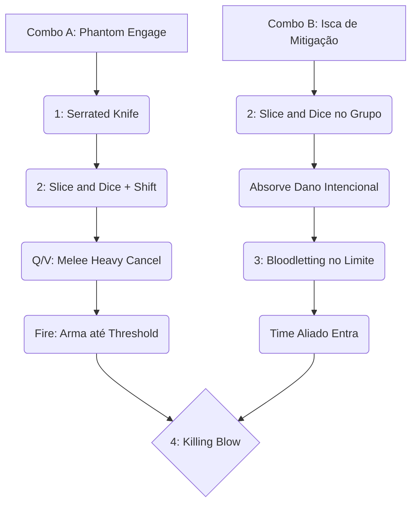

# 🗡️ GUIA DEFINITIVO COMPETITIVE-GRADE: SHIV

> [!NOTE]
> **Por:** Analista de E-sports de Elite & Especialista em Deadlock  
> **Público-Alvo:** Jogadores de Alto MMR / Pro Players

Bem-vindo ao material de estudo avançado para **Shiv**. Este guia foi projetado sob a ótica competitiva de Tiers S/A, removendo o "achismo" e implementando análise quantitativa de frames, escalonamentos e janelas de oportunidade. Shiv não é apenas um assassino; ele é um **Bruiser de Sustentação Baseado em Dano Diferido**. Para masterizá-lo, você precisa de execução mecânica perfeita e uma leitura de jogo impecável.

## 📑 Índice Rápido
*   [1. Introdução: Arquétipo, Power Spikes e Função no Meta](#1-introdução-arquétipo-power-spikes-e-função-no-meta)
*   [2. Kit Analítico: Decomposição de Habilidades](#2-kit-analítico-decomposição-de-habilidades)
*   [3. Combos Executáveis (Input-by-Input)](#3-combos-executáveis-input-by-input)
*   [4. Itemização (BUILD): Lógica de Sinergia](#4-itemização-build-lógica-de-sinergia)
*   [5. Macro & Posicionamento](#5-macro--posicionamento)
*   [6. Truques & Advanced Tech](#6-truques--advanced-tech)
*   [7. Jornada da Maestria: Do Nível 0 ao Pro Player](#7-jornada-da-maestria-do-nível-0-ao-pro-player)
*   [8. Biblioteca de Vídeos: Referências e Estudos de Caso](#8-biblioteca-de-vídeos-referências-e-estudos-de-caso)
*   [9. Radar do Meta: Análise do Patch Atual (Março 2026)](#9-radar-do-meta-análise-do-patch-atual-março-2026)
*   [10. Mentalidade 1v6: Os Melhores Itens para Carregar Solo](#10-mentalidade-1v6-os-melhores-itens-para-carregar-solo)

---

## 1. INTRODUÇÃO: Arquétipo, Power Spikes e Função no Meta

### 🧬 Arquétipo Fundamental
No mais alto nível competitivo, Shiv atua como um **Skirmisher / Execute Assassin**. Sua sobrevivência não se baseia em resistências puras (Armor/Spirit Resist), mas na manipulação mecânica do dano recebido via *Bloodletting* e na sua capacidade incomparável de finalizar combates estendidos com *Killing Blow*.

### 📈 Análise de Power Spikes

| Fase do Jogo (Souls) | Descrição do Impacto | Foco Principal |
| :--- | :--- | :--- |
| **Early Game** (0 - 3k) | Pico moderado. Shiv vence trocas longas por conta do dano base do *Serrated Knives* e punição de posicionamento. | Controle de lane e assédio sem sofrer *burst* duplo. |
| **Mid Game** (10k - 20k) | **O ÁPICE DO IMPACTO.** Adquire itens core de cooldown e mitigação, transitando rapidamente pelo mapa. | Nível 3 da *Killing Blow* para derreter lutas de equipe em AdE. |
| **Late Game** (30k+) | O papel marginaliza-se de "duelista" para "executor paciente". Foco total em utilidade e isolamento. | Flanquear, limpar alvos e abusar de imunidade (*Unstoppable*). |

> [!IMPORTANT]
> **Função no Meta Atual:** No meta de times, a função de Shiv é o **Engage Secundário (Clean-up)** ou o **Isolamento de Backline**. Você NUNCA é primário. Deixe seus Tanks (Abrams/Mo & Krill) abrirem espaço e espere a queima das habilidades de Controle de Grupo (CC).

---

## 2. KIT ANALÍTICO: Decomposição de Habilidades

### a) Serrated Knives (1)
A ferramenta de *poke* e *stack* primária.

* **Mecânica Fundamental:** Aplica um Bleed (Sangramento) que escala severamente. Ao acertar um alvo sangrando, o dano base acumula e reseta a duração.
* **Análise Quantitativa:** Possui uma hitbox de projétil fina, exigindo tracking preciso. O *Spirit Scaling* no Bleed é alto.
* **Uso Pro-Level:** Mantenha a passiva ativa no alvo prioritário *antes* do engage para acumular **Rage (Fúria)** passivamente e forçar ferramentas de cura.

### b) Slice and Dice (2)
Ferramenta de reposicionamento, dano em área e geração ativa de *Rage*.

* **Mecânica Fundamental:** Avanço rápido (Dano em Área e lentidão). Se a barra de *Rage* estiver cheia, o cooldown é resetado caso execute um inimigo.
* **Frame Data & Janela:** A animação de saída (*recovery frames*) é cancelável por saltos ou ataques *Melee*.
* **Uso Pro-Level:** Utilize como *gap-closer* diagonal para evitar tiros em linha reta ou escalar terrenos verticais complexos.

### c) Bloodletting (3) - O Núcleo do Personagem
> [!WARNING]
> *A habilidade que define um bom Shiv de um Deus do servidor.*

* **Mecânica Fundamental:** **Passiva:** Alta % do dano recebido é "diferido" em um sangramento em si mesmo. **Ativa:** Limpa grande parte desse dano.
* **Análise Quantitativa:** O cooldown dessa habilidade é a janela de vulnerabilidade absoluta do Shiv. No nível máximo (+ *Cooldown Reduction*), você cria uma "falsa barra de HP" massiva.
* **Uso Pro-Level:** NUNCA ative preemptivamente. Você deve ler a animação do *burst* inimigo e ativar *logo após* o pico de dano. Cuidado com *Anti-Heal* (Healbane/Toxic Bullets), pois reduzem a eficiência da mitigação.

### d) Killing Blow (4)
* **Mecânica Fundamental:** Salto inalvejável com execução instantânea se o alvo estiver abaixo do *threshold* de HP. Em **Full Rage**, o *threshold* sobe e o cooldown reseta no abate.
* **Análise Quantitativa:** O cálculo de execução ignora escudos e resistências. O salto tem *tracking* pesado, mas falha se houver quebra rígida de linha de visão.
* **Uso Pro-Level:** Os *i-frames* protegem contra *ultimates* mortais. Em desespero, o salto curto sem alvo ainda causa dano em área.

---

## 3. COMBOS EXECUTÁVEIS (Input-by-Input)

O jogo de Shiv requer um APM (*Actions Per Minute*) elevado. Abaixo estão os fluxos de combate recomendados.

#### Combo A: "O Engage Phantom" (Assassino Isolado)
**Propósito:** Isolar e vaporizar um DPS da backline sem tempo de resposta.
1. `1` **(Serrated Knife):** A média distância. Builda Rage e inicia Bleed + Slow.
2. `Shift + 2` **(Dash + Slice and Dice):** O *Dash* dá inércia estendendo o *range*.
3. `Melee Heavy` **(Q/V Segurado):** Cancela os frames de recuperação.
4. **Arma de Fogo:** Track no alvo até o limiar crítico.
5. `4` **(Killing Blow):** Execução confirmada no caos.

#### Combo B: "A Isca de Mitigação" (Teamfight Frontline)
**Propósito:** Quebrar os principais *cooldowns* da equipe adversária e sair vivo.
1. `2` **(Slice and Dice):** Diretamente no time inimigo para *Full Rage*.
2. **Absorção (Passiva):** Receba intencionalmente o dano de 2-3 habilidades pesadas.
3. `3` **(Bloodletting):** Apague 40-50% do dano iminente no último milissegundo seguro.
4. **Espaço Aberto:** Seu time *engaja* agora.
5. `4` **(Killing Blow):** Resets infinitos na *backline* com a fúria cheia e alvos miados pelo seu time.

---

## 4. ITEMIZAÇÃO (BUILD): Lógica de Sinergia

A itemização de um Pro Player foca em **aceleração de animações**, **janelas de invulnerabilidade** e **maximização de curas**.

| Estágio | Itens Principais | Justificativa |
| :--- | :--- | :--- |
| 🔹 **Early Game** | `Extra Health`, `Enduring Spirit`, `Extra Stamina` | A vida base do Shiv multiplicada pelo dano diferido vira *EHP* absurda. Stamina é essencial para *slide cancels*. |
| 🔹 **Mid Game** | `Enchanter's Barrier`, `Improved Cooldown`, `Quicksilver Reload` | O escudo mitiga antes do *Bloodletting* acumular. Redução de recarga no (3) é inegociável. Amarre o *Quicksilver* no (1) ou (2). |
| 🔹 **Late Game** | `Unstoppable`, `Leech`, `Escalating Exposure` | **Unstoppable (Crucial):** Evita morte certa por CC durante cadeia de execuções. A exposição de escalonamento aumenta o dano híbrido passivamente. |

---

## 5. MACRO & POSICIONAMENTO

### A Arte das Rotas (Pathing)
> [!TIP]
> Em alto nível, o minimapa é seu maior aliado. Se os inimigos estão na tela, você está fazendo errado.

* **Flancos:** Shiv DEVE jogar pelas "ruas laterais" e varandas. Suas entradas no Mid/Boss devem ser sempre pelo ângulo cego (costas).
* **Verticalidade:** Utilize o `Slice and Dice` para fechar espaços entre telhados e ficar pendurado. Iniciar caindo de cima é infinitamente mais forte do que entrar correndo de frente.

### Timing de Iniciação
> [!CAUTION]
> **A Regra dos 3 Segundos:** Quando a *fight* estourar, conte exatamente **3 segundos físicos**. É o período em que os inimigos queimam CC defensivo em desespero (Curse, Silence Glyph, Rescue Beam). Só ataque a *backline* quando o desespero passar.

---

## 6. TRUQUES & ADVANCED TECH

Existem mecânicas fruto da engine física (Source) que elevam seu teto de habilidade:

1. 🛡️ **I-Frame Abuse no Killing Blow:** Quando escutar a *ultimate* de um Sniper ou a bomba do Bebop, iniciar seu (4) em QUALQUER alvo (até creep) o torna "in-alvejável", anulando dano imenso de *tracking*.
2. 🩸 **Bloodletting vs Anti-Heal:** O *Healbane* corta severamente sua purgação. **Tech:** Dê *dash* para trás, quebre a visão, espere o *debuff* de Anti-Heal cair do seu boneco e SÓ ENTÃO purgue.
3. 👟 **Dash Slide Cancellations:** Pressione `Crouch` imediatamente após o `Dash Direcional` para estender seu momento inercial. Soltar o Canivete no meio da rasteira esconde sua *hitbox*.
4. 🥊 **Heavy Melee Baiting (Parry Tech):** Avance visando o combate corpo-a-corpo para atrair o *Parry* inimigo, dê *Dash/Slice and Dice* PARA TRÁS, e espanque o alvo paralisado pela animação de erro deles.

---

## 7. JORNADA DA MAESTRIA: Do Nível 0 ao Pro Player

Siga este roteiro evolutivo para solidificar sua fundação antes de interagir com mecânicas avançadas.

### 🐣 Estágio 1: O Novato (Foco em Fundamentos)
*   **O Que Treinar:** Acertar o *Serrated Knives* (1) consistentemente prevendo o movimento do alvo.
*   **Dica de Ouro:** Guarde o *Slice and Dice* (2) VERGONHOSAMENTE apenas para fugir.
*   **Gestão do Bloodletting (3):** Pressione apenas com HP abaixo da metade e a barra cinza de diferimento clara.
*   **Métrica de Sucesso:** Sobreviver à *laning phase* sem *feedar*.

### 🦅 Estágio 2: O Intermediário (Foco em Combate e Fúria)
*   **O Que Treinar:** Gerenciamento da mecânica de *Rage* (Fúria). Lutas sem fúria são letais para o Shiv.
*   **Dica de Ouro:** Só utilize a *ultimate* quando ver a **caveira vermelha piscando**. Pare de gastá-la de forma imprudente.
*   **Gestão do Bloodletting (3):** Comece a parear o uso do (3) para anular ultimates inimigas diretas, e não apenas danos residuais de tiros.
*   **Métrica de Sucesso:** Confirmar **duas execuções consecutivas** na mesma *teamfight*.

### 🐉 Estágio 3: A Caminho da Maestria (Animações e Limites)
*   **O Que Treinar:** *Slide cancels*, *Melee cancels* e pura economia de *Stamina* em *parkour*.
*   **Dica de Ouro:** Dano *burst* de um Ataque Pesado (*Heavy Melee*) misturado ao sangramento vence o x1 contra 90% do elenco.
*   **O "God Mode":** Dance com o perigo. Posicione-se para receber "poke letal" de propósito, purge no último segundo com o (3) e vire o *engage*.
*   **Métrica de Sucesso:** Engajar, obliterar um alvo primário (Healer/DPS forte), e sair vivo quebrando o tracking de câmera inimigo abusando da verticalidade do terreno.

---

## 8. BIBLIOTECA DE VÍDEOS: Referências e Estudos de Caso

A teoria te leva até certo ponto; a observação forja a maestria. Abaixo separamos alguns materiais de estudo produzidos pela comunidade que detalham a aplicação prática das mecânicas avançadas:

*   🎥 **[How to play SHIV | DEADLOCK Beginners Guide](https://www.youtube.com/results?search_query=How+to+play+SHIV+DEADLOCK)**
    *   **Foco Principal:** Guia completo de *Controlled Aggression* (Agressão Controlada). Excelente para construir a base do Novato até o Intermediário, focando na transição de rotas para *teamfights*.
*   🎥 **[Shiv OP MELEE Fast Farm Stealth Ganker - Tank Build Guide](https://www.youtube.com/results?search_query=Shiv+OP+MELEE+Fast+Farm+Stealth+Ganker+Tank+Build+Guide+Deadlock)**
    *   **Foco Principal:** Rotação de *farm* otimizada e construção de Tank/Mobilidade para *ganks* furtivos. Mostra como liderar o placar de *Souls* e Dano da partida.
*   🎥 **[Shiv Guides & Teardowns (Mobalytics/Comunidade)](https://www.youtube.com/results?search_query=Deadlock+Shiv+Gampelay+Pro)**
    *   **Foco Principal:** Estudo da *Bleed Shiv Build* e do teto mecânico no *Late Game*. Focado em maximizar o dano passivo de sangramento para derreter os tanques adversários.

> [!TIP]
> **💡 Dica de Estudo Ativo:** Ao assistir *gameplays* de jogadores de alto MMR com o Shiv, **pause o vídeo** sempre que eles entrarem em uma grande *teamfight*. Olhe para as *ultimates* inimigas ativas e tente prever *exatamente quando* o jogador usará o **Bloodletting (3)**. Se ele usar num momento diferente do seu palpite, rebobine o vídeo e analise: *O que ele mitigou que você não viu?*

---

## 9. RADAR DO META: Análise do Patch Atual (Março 2026)

O meta de Deadlock é dinâmico, e Shiv passou por um verdadeiro "carrossel de balanceamentos" neste começo de 2026. Abaixo está a leitura técnica de como o personagem opera **hoje** e do que abusar antes que a foice dos *nerfs* acerte ele.

### 📊 O Que Mudou Recentemente?
*   🔪 **Serrated Knives (Remake):** O dano de impacto direto foi totalmente **removido**, em contrapartida, o **Escalonamento de Sangramento (Bleed) foi GIGANTEMENTE buffado**. O tempo de recarga subiu ligeiramente (16s ➡️ 18s).
*   💀 **Killing Blow (Mini-Rework):** O alcance avançou de 13m para **18m** (um *buff* colossal de iniciação), porém agora trata-se de um **Skillshot** e requer mira braçal refinada. Executar um inimigo não zera mais o recuo de forma pura; em vez disso, concede uma farta **janela de recast livre de 20 segundos**.
*   🏃 **Status Virtuais:** Perdeu velocidade de movimentação base natural (forçando o domínio pesado dos *Dash Cancels*) e se beneficiou imensamente do **Buff Global de HP** que todos os personagens do jogo receberam em Março.

### 🚨 O Que Está "Roubado" Hoje? (Tier S+)
A combinação matemática do **Buff de Sangramento Extremo** com o **Buff Global de Vida dos Heróis** tornou Shiv o caçador de *Tanks* absoluto. Como a sua Ultimate executa com base em **Porcentagem de Vida (Threshold)**, ele não liga se o Abrams ou o Mo & Krill estão com 1.500 ou 4.500 de HP. Além disso, o alcance do salto foi para absurdos **18 metros** com velocidade de vôo aumentada: isso possibilita iniciações de prédios que não existem no campo de visão do inimigo.

### 📉 Previsões Iminentes de Nerfs: Abuso com Prazo Múltiplo
> [!WARNING]
> O estado de Shiv focado em Espírito e Sangramento está opressivo em lobbys altos. Eis o que os desenvolvedores podem/devem atacar no próximo Micro-Patch:
> 1. **Janela de *Recast* da Ultimate Demasiada Longa:** 20 Segundos livres para pular usando a *Killing Blow* novamente no meio do caos é tempo de sobra. É altamente provável que essa janela de tolerância sofra um corte radical para cerca de 10-12s.
> 2. **Multiplicador Opulento do Sangramento de Facas:** A build *"Bleed Shiv"* que escala com Dano Espiritual está desequilibrada, corroendo os alvos passivamente em pouquíssimo tempo. Espere nerfs na conversão passiva (Espírito ➡️ Dano de Bleed).
> 3. **Gap Close Total (Alcance do Ultimate):** 18 metros num herói capaz de absorver dano pelo *Bloodletting* gera rotações sufocantes. A expectativa é que o salto caia para o ponto de equilíbrio na casa dos **15 metros**.

---

## 10. MENTALIDADE 1v6: Os Melhores Itens para Carregar Solo

Se você está na Fila Solo (*Solo Queue*) e percebe o seu time colapsando mecanicamente aos 10 minutos de jogo, a etiqueta de "Engage Secundário" cai por terra. Para colocar a partida no bolso e jogar no limite do 1v6, sua itemização deve migrar de *Mitigação/Utilidade* para **Mobilidade de Guerrilha e Roubo de Vida Perpendicular (Baseado em Sangramento)**.

### 🎒 O Arsenal "Egoísta" (A Build do Solo Carry)
*   🟣 **Majestic Leap / Warp Stone (Tier 3):** Indispensável. Em Solo Q, você não tem um tanque confiável para quebrar a linha de frente. Com *Warp Stone*, você elimina alvos chave pulando muros de 18m, assassina o Suporte/DPS deles, e usa o *Slice and Dice* (2) para sumir nas calhas da rua.
*   🟢 **Spirit Lifesteal (Tier 2/3):** O pilar do combate prolongado. Seu Dano Espiritual (O Sangramento da faca 1) é colossal. O *Spirit Lifesteal* converte cada inimigo sagrando na tela em uma *poção de vida passiva* inesgotável para você enquanto realiza seus *parkours*.
*   🟠 **Toxic Bullets + Escalating Exposure (Tier 3/4):** Sua resposta matemática contra Tanques que farão armadura pesada contra você. O *Toxic Bullets* drena o HP em porcentagem e corta a cura deles, enquanto a *Escalating Exposure* debuffa a resistência mágica inimiga a cada hit de bala, combando perfeitamente com os "tíques" dos canivetes.
*   🟢 **Unstoppable (Core Supremo - Tier 4):** Entrar no meio de 4 pessoas para buscar um abate significa que eles lançarão todos os C.Cs e *Silences* em você. Ativar a *Unstoppable* garante uma janela absoluta para descarregar o pente, conjurar o salto da ultimate (*Killing Blow*) e sair vivo. Morte é inaceitável para o *Solo Carry*.

### 🧠 Táticas Sujas para Vencer Sozinho
> [!IMPORTANT]
> **A Regra da Sobrevivência Solo:** A pior play do mundo em Solo Q é trocar 1 por 1 de igual pra igual. Se você é o Carry, sua vida vale muito mais do que a do alvo. Elimine com margem de segurança e jamais force algo se não tiver o Purgo do (3) ativo.

1. **Faça *Split Push* Gélido:** Shiv derrete selvas extremamente rápido com as atualizações recentes. Se seu time insiste em lutas sem sentido no Meio de mapas perdidos, ignore-os. Empurre *Vanguards* das bordas, force 2 adversários recuarem pra limpar o rastro de base. Se vier 1, você ganha o 1v1. Se vierem 3, você foge com o Dash e cria espaço temporal na partida.
2. **Farm Tributário (Drene o Mapa):** Num jogo de 1v6, a selva inteira pertence a **VOCÊ**. Destrua latas, colete *Troopers* nas rotas avançadas e quebre estátuas. Para conseguir carregar, você precisa bater **30k Souls** enquanto o jogador mais forte inimigo tiver **17k**. Shiv suga recursos num ritmo frenético se não focar em trocar tiro de graça.
3. **Identidade do Assassino Único (Focus Seletivo):** O time adversário pode estar com $50k a mais de farm, mas o dinheiro deles está concentrado em apenas **um DPS superestimado** (O Carry deles). A única função que existe pra a sua barra de vida é flanquear de forma invisível no mapa, gastar a sua (4) na cabeça dessa pessoa específica e esvaziar a pressão. Mate a "cabeça da cobra", e a fila Solo adversária entra em pânico e começa a lutar desorganizada.

---
*Fim do documento original. Ajuste sua gameplay ao Patch, jogue limpo, mas derrote eles sujo.*
