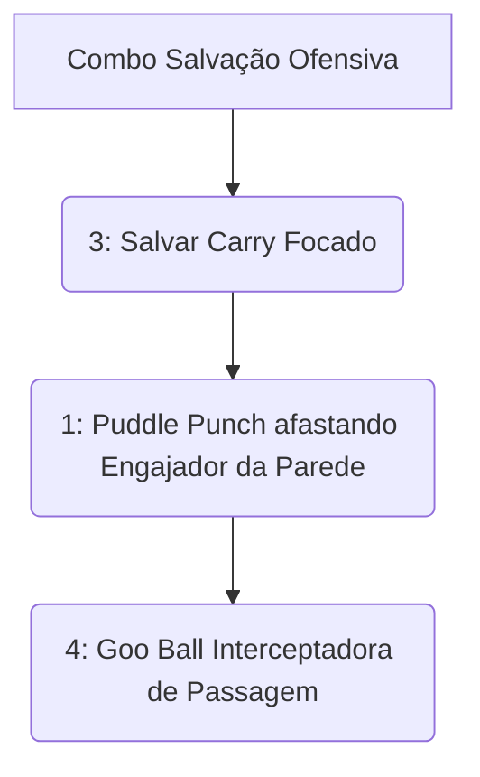

# 👑 GUIA DEFINITIVO COMPETITIVE-GRADE: VISCOUS

> [!NOTE]
> **Por:** Analista de E-sports de Elite & Especialista em Deadlock  
> **Público-Alvo:** Jogadores de Alto MMR / Pro Players

Bem-vindo ao material de estudo avançado para **Viscous**. Este guia foca no ser mais versátil do jogo, o mestre do "Slime". Ele atua como **Disruptor de Utilidade / Suporte Inalvejável**. O domínio do Viscous exige entender a tridimensionalidade do mapa e não errar *isollations* com o Cubo (3) nos aliados certos.

## 📑 Índice Rápido
*   [1. Introdução: Arquétipo, Power Spikes e Função no Meta](#1-introdução-arquétipo-power-spikes-e-função-no-meta)
*   [2. Kit Analítico: Decomposição de Habilidades](#2-kit-analítico-decomposição-de-habilidades)
*   [3. Combos Executáveis (Input-by-Input)](#3-combos-executáveis-input-by-input)
*   [4. Itemização (BUILD): Lógica de Sinergia](#4-itemização-build-lógica-de-sinergia)
*   [5. Macro & Posicionamento](#5-macro--posicionamento)
*   [6. Truques & Advanced Tech](#6-truques--advanced-tech)
*   [7. Jornada da Maestria: Do Nível 0 ao Pro Player](#7-jornada-da-maestria-do-nível-0-ao-pro-player)
*   [8. Biblioteca de Vídeos: Referências e Estudos de Caso](#8-biblioteca-de-vídeos-referências-e-estudos-de-caso)
*   [9. Radar do Meta: Análise do Patch Atual](#9-radar-do-meta-análise-do-patch-atual)
*   [10. Mentalidade 1v6: Os Melhores Itens para Carregar Solo](#10-mentalidade-1v6-os-melhores-itens-para-carregar-solo)

---

## 1. INTRODUÇÃO: Arquétipo, Power Spikes e Função no Meta
### 🧬 Arquétipo Fundamental
Viscous é a personificação do anti-burst. Seu foco não é causar danos em segundos finais de luta de tanque massivos isolados, mas rebater todo o engajamento inimigo inicial usando a Gosma (Goo) como reposicionador universal forçando fugas táticas caóticas inimigas dispersando formações rígidas em *Choke Points*.

### 📈 Análise de Power Spikes
> [!IMPORTANT]
> A Função real sua no Meta: **Anti-Engage**. Enquanto Abrams inicia do nada empurrando as frentes defensivas, o Viscous rebela esse empurrão purificando quem apanhou no cubo de salvamento (*Cube*) virando brigas brutas pra si em bolas indestrutíveis (*Goo Ball*).

---

## 2. KIT ANALÍTICO: Decomposição de Habilidades

### a) Puddle Punch (1)
* **Mechanica:** Ataca com um soco do chão retardado lançando alvo para trás do campo de impacto físico duro esparso. Aumenta dano base no escalonamento final de *Spirit Power*.

### b) Splatter (2)
* **Mechanica:** Lança bolha que gruda de tempos e diminui movimentação em área escorregadia residual. Exímio removedor agressivo de rotas limpas abertas rápidas, atrapalhando o farm isolado natural (*CS*).

### c) The Cube (3)
> [!WARNING]
> *A identidade definitiva mecânica de salvamento suportivo da gosma bruta!*
* **Mecânica Fundamental:** Coloca o alvo aliado (ou você mesmo) incancelável no cubo que limpa CC e cura ferimentos progressivos purificados da arena num estado de invencibilidade passiva total até a quebra natural. Salvamento superior limpo de combates mortos.

### d) Goo Ball (4)
* **Mecânica Fundamental:** Torna-se esférico rápido ricocheteando como pinball paralisando atiradores tocados, fugindo escorregando danos contínuos pelo cenário massivo aberto! Pulos duplos de parede para fugas!

---

## 3. COMBOS EXECUTÁVEIS (Input-by-Input)

1. `3` **(Cubo de Gelo Gosmento):** Mirar no DPS amigo stunnado no chão.
2. `1` **(Soco Retrátil):** Afastar o assassino que tentava quebrar o amigo.
3. `4` **(Goo Ball):** Rolar atordoando todos os fofos agressivos de perto.

---

## 4. ITEMIZAÇÃO (BUILD): Lógica de Sinergia
| Estágio | Itens Principais | Justificativa |
| :--- | :--- | :--- |
| 🔹 **Mid Game** | `Superior Cooldown`, `Improved Reach` | As bolas (2) precisam fechar quarteirões inteiros isolando fugas! |
| 🔹 **Late Game** | `Knockdown`, `Rescue Beam` | Multiplica sua ação de Suporte Pro. Salva os heróis de longe puxando para seu lado de cobertura passiva do fundo do funil do campo verde base no *late.* |

---

## 10. MENTALIDADE 1v6: Os Melhores Itens para Carregar Solo
Se o DPS do seu time for inexistente:
* **Espirito de Combate Perfurador:** Maximize a velocidade do Soco (1). Com `Echo Shard` Viscous soca duas vezes seguidas e tira snipers do mapa jogando atiradores imponentes pelas varandas limpas abertas de telhado nos fundos da escada lateral dos bosses perigosos! O jogo flui na base da agressividade do CC!
---
*Fim do documento.*
