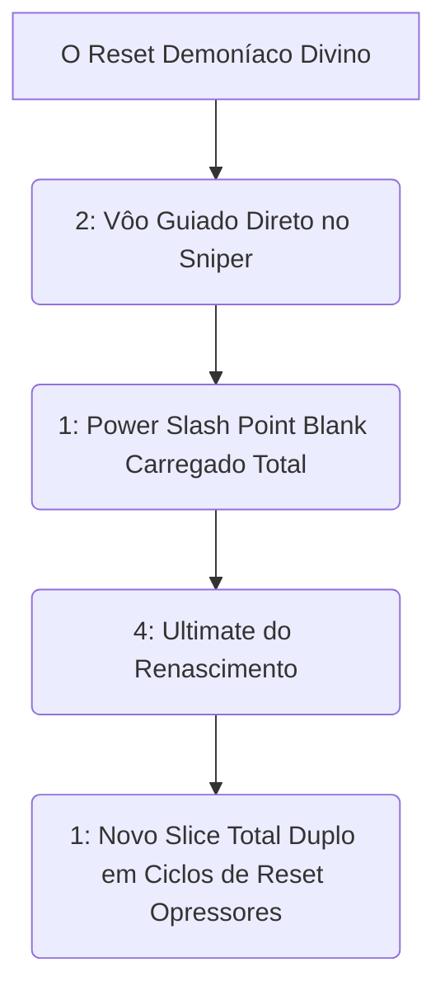

# 👑 GUIA DEFINITIVO COMPETITIVE-GRADE: YAMATO

> [!NOTE]
> **Por:** Analista de E-sports de Elite & Especialista em Deadlock  
> **Público-Alvo:** Jogadores de Alto MMR / Pro Players

Bem-vindo ao material avançado para **Yamato**. A maga samurai assassina de alta curva de aprendizado. Diferente do Shiv que foca em DoT (*Damage over Time*), Yamato é o monstro do **Burst Verdadeiro Ponto A -> B**. Seus reflexos determinarão se Yamato se cura infinitamente na Ultimate ou se torna um *feed* ambulante na linha central escura da selva perigosa de assassinos ruidosos!

## 📑 Índice Rápido
*   [1. Introdução: Arquétipo, Power Spikes e Função no Meta](#1-introdução-arquétipo-power-spikes-e-função-no-meta)
*   [2. Kit Analítico: Decomposição de Habilidades](#2-kit-analítico-decomposição-de-habilidades)
*   [3. Combos Executáveis (Input-by-Input)](#3-combos-executáveis-input-by-input)
*   [4. Itemização (BUILD): Lógica de Sinergia](#4-itemização-build-lógica-de-sinergia)
*   [5. Truques & Advanced Tech](#5-truques--advanced-tech)
*   [6. Mentalidade 1v6: Os Melhores Itens para Carregar Solo](#6-mentalidade-1v6-os-melhores-itens-para-carregar-solo)

---

## 1. INTRODUÇÃO: Arquétipo, Power Spikes e Função no Meta
### 🧬 Arquétipo Fundamental
**High Skill-Cap Burst Assassin.** O herói de maior recompra mecânica por habilidade (*Skill Ceiling*). Requer tempo em recargas puras e desvios. O uso exato do seu voo gancho no inimigo com finalizações perfeitas separa o ouro dos jogadores do *Low MMR*. Yamato isola de frente.

---

## 2. KIT ANALÍTICO: Decomposição de Habilidades

### a) Power Slash (1)
* **Mechanica:** Um corte pesado focado com braço de espada pura, escalando monstruosamente num carregamento incancelável e curando se maximizada *Mid-Late*.

### b) Flying Strike (2)
> [!WARNING]
> *A mobilidade vertical invulnerável direcional.*
* **Mecânica:** O "Gancho" letal. Gruda no alvo sem parar em paredes atravessando o que for pra chegar perto. Fuga das restrições e curas massivas dos desvios verticais contra teto baixo nos alvos nas sombras do mapa 3D!

### c) Crimson Slash (3)
* **Mecânica Fundamental:** Um soco/corte defensivo curto retardado com regenerações amplas pelo impacto nas selvas lotadas das minion waves pesadas nas calçadas escuras lúdicas lentas no *CS* inicial frouxo da classe de combate tático dela pura de *Balling*.

### d) Shadow Transformation (4 - Ultimate)
* **A Marca do *1v5* God Mode:**
* Ganha Invulnerabilidade Literal da morte durante preciosos segundos, resetando habilidades puramente para refazer combos! Custa longo tempo de preparação na animação incial; jogadores de Alto MMR usam-a não no final e sim logo que descem no combo duplo aéreo na explosão bruta letal espremendo todos os botões de Dano Perfeitamente dobrado em Reset Instantâneos do Gelo Morto finalizado! O buff curativo é esmagador sobre o corpo demoníaco ativo nos 6 segundos sagrados eternos de fuga com dano extremo sem perigo à Barra Verde (HP)!

---

## 3. COMBOS EXECUTÁVEIS (Input-by-Input)

---

## 4. ITEMIZAÇÃO (BUILD): Lógica de Sinergia
| Estágio | Itens Principais | Justificativa |
| :--- | :--- | :--- |
| 🔹 **Mid Game** | `Spirit Power`, `Improved Cooldown` | A cura espanca os magos. Aumento base massivo nos cortes laterais longos na esquiva curta diagonal tática brutal no meio do combate espremido rápido da ponte morta.* |
| 🔹 **Late Game** | `Refresher`, `Leech`, `Superior Burst` | Duplicar Ultimate? Em lutas lentas, *Refresher* é crime limpo. A cura total em imortalidade não deixa Yamato parar de quebrar *Vindictas* nos telhados de patrulha baseada no gelo escorregadio mortal furtivo da facada fatal vermelha incandescente do purgatório do submundo dos caídos imortais do Deadlock limpo. |

---
*Fim do documento.*
